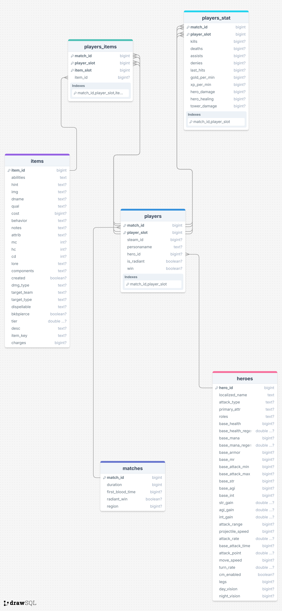
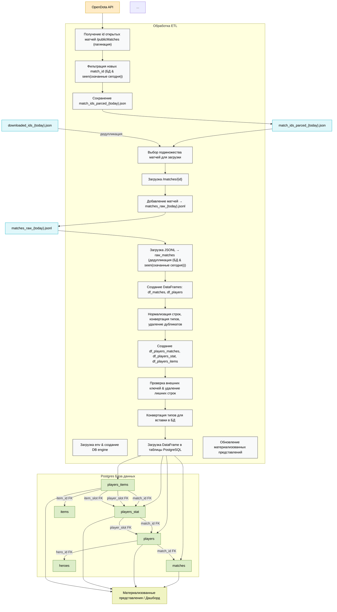

# Dota2 - сбор и подготовка данных об открытых матчах

Целью проекта является создание аналитической панели, которая получает данные об открытых матчах Dota2. Для реализации этой цели необходимо написание скрипта, который будет загружать, обрабатывать и хранить данные о матчах Dota2.

## Содержание

- [Dota2 - сбор и подготовка данных об открытых матчах](#dota2---сбор-и-подготовка-данных-об-открытых-матчах)
  - [Содержание](#содержание)
  - [Обзор проекта](#обзор-проекта)
  - [Этап 1: Сбор и первичная обработка данных](#этап-1-сбор-и-первичная-обработка-данных)
    - [Этап 1.1. Сбор данных](#этап-11-сбор-данных)
    - [Этап 1.2. Знакомство с данными и первичная обработка](#этап-12-знакомство-с-данными-и-первичная-обработка)
  - [Этап 2: Создание базы данных](#этап-2-создание-базы-данных)
  - [Этап 3: Создание материализованных представлений (MV)](#этап-3-создание-материализованных-представлений-mv)
  - [Этап 4: Создание дашборда](#этап-4-создание-дашборда)
  - [Этап 5: Подготовка ETL-пайплайна](#этап-4-подготовка-etl-пайплайна)
  - [Использование](#использование)

## Обзор проекта

Проект включает этапы:
* Анализ API opendota на предмет отдаваемых данных
* Определение данных для подготовки аналитических панелей
* Написание парсеров для получения данных
* Определение структуры базы данных
* Создание обработчика данных
* Заполнение базы данных (2000 запросов в сутки к API opendota)
* Подготовка витрин данных
* Подключение базы данных к BI-системе
* Реализация аналитических панелей

Итог:  
Подготовлен ETL пайплан: скачивание и преобразование данных, загрузка в базу данных, обновление материализованных представлений

**Стек**: 
* Python: requests, pandas, sqlalchemy, matplotlib, seaborn, numpy
* PostgreSQL
* BI система: Yandex DataLens

## Этап 1: Сбор и первичная обработка данных

### Этап 1.1. Сбор данных

Jupyter Notebook файлы:  
Парсинг данных с OpenDota API [parsing_api_dota_initial.ipynb](parsing_api_dota_initial.ipynb)  
Парсинг данных с GitHub [parce_items_git.ipynb](parce_items_git.ipynb)  

* Подключение к OpenDota API:
  * Ограничение: не более 2000 запросов в сутки, не более 60 запросов в минуту
  * Загрузка перечня id открытых матчей (`match_id`):
    * Эндпоинт OpenDota: `GET /publicMatches`:
    * Получение списка открытых матчей (`match_id`) с пагинацией
    * Сохранение прогресса в `match_ids.json`
  * Сбор информации о матчах:
    * Эндпоинт OpenDota: `GET /matches/{match_id}`
    * Скачивается полная карточка каждого матча
    * Загрузка в `matches_raw.jsonl`
  * Загрузка информации о героях:
    * Эндпоинт OpenDota: `GET /heroStats`
    * Получение справочника всех героев с характеристиками (атрибуты, роли, базовые параметры и т.д.)
  * Создание CSV-файлов:
    * df_matches.csv — информация о матчах
    * df_players.csv — информация об игроках
    * df_heroes.csv - информация о героях
* Сбор информации о предметах из GitHub
  * Источник: https://raw.githubusercontent.com/odota/dotaconstants/master/build/items.json
  * Получение справочника всех предметов с характеристиками
  * items.csv - информация о предметах

Итого: Скачано ~ 20 тыс матчей

### Этап 1.2. Знакомство с данными и первичная обработка

Jupyter Notebook файл: [csv_preparation_initial.ipynb](csv_preparation_initial.ipynb)  

* Подготовка данных к загрузке в базу данных:
  * Импорт в Jupyter Notebook ранее сохранённых CSV: matches.csv, players.csv, heroes.csv, items.csv
  * Нормализация строковых данных, преобразование типов (Int, bool)
  * Разделение `players.csv` на три таблицы:
    * `players_matches` – основная информация об игроках в матчах
    * `player_stat` – статистика игроков
    * `player_items` – предметы игроков, преобразованные из широкого формата в плоский
  * Проверка совпадения внешних ключей между таблицами (`match_id`, `player_slot`, `hero_id`, `item_id`)
  * Удаление дубликатов и лишних строк
  * Сохранение подготовленных датафреймов в CSV: matches.csv, players.csv, player_stat.csv, player_items.csv, heroes.csv, items.csv
  
## Этап 2: Создание базы данных

База данных PostgreSQL развернута на сервисе Supabase.com  

Схема базы данных: "снежинка".

Баща данных содержит следующие таблицы:  
* нормализованные измерения: `heroes`, `items`, `players`,`matches`
* Связи через промежутоне таблицы: `players_stat`, `players_items`
* Иерархические связи: 
  * `matches` → `players` → `heroes`
  * `matches` → `players` → `players_stat` → `players_items` → `items`

Выполнена загрузка CSV файлов, подготовленных на ранних этапах в базу данных

Диаграмма Базы Данных:  

 
## Этап 3: Создание материализованных представлений (MV)

Jupyter Notebook: [mv_creation.ipynb](mv_creation.ipynb)

* Подключение к базе данных
  * Использовалась SQLAlchemy (`create_engine`) для подключения к PostgreSQL (Supabase).
  * Настройка параметров через `.env` файл. 
    * ссылка на пример .env файла [example.env](example.env)
  * Проверка соединения через `engine.connect()`.
* Для аналитических панелей были реализованы следующие витрины данных в виде представлений:
  * Статистика побед Radiant по длительности матчей `radiant_win_by_duration`
  * Статистика по регионам `regions_stat`
  * Факторы, влияющие на победу `win_factors`
  * Статистика использования героев `heroes_stat`
  * Winrate по золоту на команду (GPM) `gmp_winrate`
  * Статистика по неизвестным игрокам (анонимам) `unknown_players`

## Этап 4: Создание дашборда

Ссылка на дашборд: https://datalens.yandex/kv8lvzzuoft65

- Цель: создание у новичка общего представления об игре Дота2
- Визуализация данных через Yandex DataLens
- Подключение к PostgreSQL и материализованным представлениям
- Вкладки дашборда:
  - Общая информация: общая информация об игре и собранных данных
  - Факторы, влияющие на победу
  - Статистика по серверам
  - Герои: поиск инсайтов о героях, более детальная информация
  - Анонимы: поиск различий в игре анонимов и публичных игроков

## Этап 5: Подготовка ETL-пайплайна

Jupyter Notebook: [etl_pipeline.ipynb](etl_pipeline.ipynb)

Полный пайплайн скачивания данных по матчам и игрокам Dota2 и загрузки их в базу данных:
* Получение ID матчей и их данных через API
* Дедупликация и нормализация данных
* Создание DataFrame: df_matches, df_players, df_players_stat, df_players_items
* Валидация данных
* Вставка данных в PostgreSQL (транзакции)
* Обновление материализованных представлений

*Используемые библиотеки*: pandas, requests, SQLAlchemy, dotenv, pathlib, json

Диаграмма детализированного пайплайна:

## Использование

* Создание .env или supabase.env с данными для подключения к БД.
* Запуск ETL-пайплайна (Этап 5)
* Открытие дашборда для анализа.

